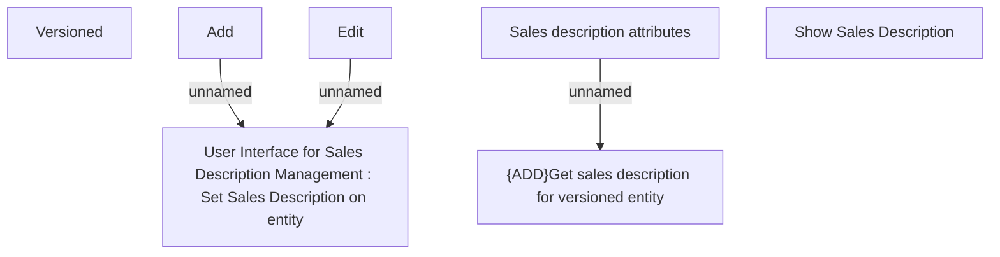

# Show Sales Description on entity

```mermaid
graph TD
    Versioned["Versioned"]
    ADD_Get_sales_description_for_versioned_entity["{ADD}Get sales description for versioned entity"]
    User_Interface_for_Sales_Description_Management_Set_Sales_De["User Interface for Sales Description Management : Set Sales Description on entity"]
    Add["Add"]
    Edit["Edit"]
    Sales_description_attributes["Sales description attributes"]
    Show_Sales_Description["Show Sales Description"]
    Add -->|unnamed| User_Interface_for_Sales_Description_Management_Set_Sales_De
    Edit -->|unnamed| User_Interface_for_Sales_Description_Management_Set_Sales_De
    Sales_description_attributes -->|unnamed| ADD_Get_sales_description_for_versioned_entity
```
