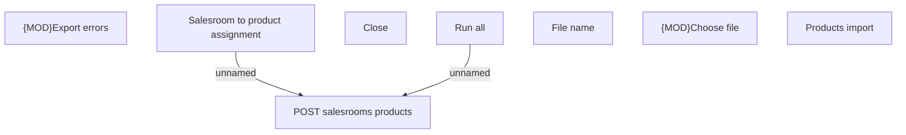

# Products import

- **Diagram Type**: Custom
- **Package**: HomerSelect/BSL/Modules/Product Catalog (PRC)/Analytical Model/Salesroom/User Interface
- **Diagram ID**: 163878
- **Elements**: 8
- **Connectors**: 2

