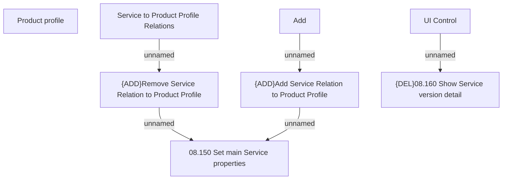

# {ADD} TAB Service to Product Profile Relations

```mermaid
graph TD
    n_08_150_Set_main_Service_properties["08.150 Set main Service properties"]
    Product_profile["Product profile"]
    ADD_Remove_Service_Relation_to_Product_Profile["{ADD}Remove Service Relation to Product Profile"]
    ADD_Add_Service_Relation_to_Product_Profile["{ADD}Add Service Relation to Product Profile"]
    DEL_08_160_Show_Service_version_detail["{DEL}08.160 Show Service version detail"]
    Add["Add"]
    Service_to_Product_Profile_Relations["Service to Product Profile Relations"]
    UI_Control["UI Control"]
    ADD_Remove_Service_Relation_to_Product_Profile -->|unnamed| n_08_150_Set_main_Service_properties
    ADD_Add_Service_Relation_to_Product_Profile -->|unnamed| n_08_150_Set_main_Service_properties
    UI_Control -->|unnamed| DEL_08_160_Show_Service_version_detail
    Add -->|unnamed| ADD_Add_Service_Relation_to_Product_Profile
    Service_to_Product_Profile_Relations -->|unnamed| ADD_Remove_Service_Relation_to_Product_Profile
```
