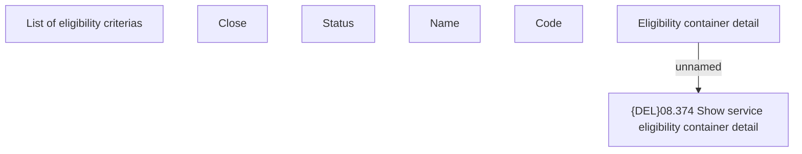

# Eligibility Container detail

- **Diagram Type**: Custom
- **Package**: HomerSelect/BSL/Modules/Product Catalog (PRC)/Analytical Model/Service/Service Eligibility Management/User Interface
- **Diagram ID**: 78400
- **Elements**: 7
- **Connectors**: 1

