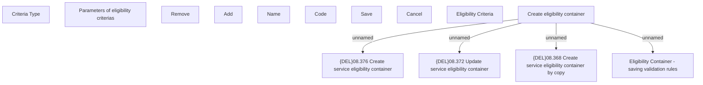

# Set Eligibility Container

```mermaid
graph TD
    Eligibility_Container_saving_validation_rules["Eligibility Container - saving validation rules"]
    DEL_08_368_Create_service_eligibility_container_by_copy["{DEL}08.368 Create service eligibility container by copy"]
    Criteria_Type["Criteria Type"]
    Parameters_of_eligibility_criterias["Parameters of eligibility criterias"]
    DEL_08_372_Update_service_eligibility_container["{DEL}08.372 Update service eligibility container"]
    DEL_08_376_Create_service_eligibility_container["{DEL}08.376 Create service eligibility container"]
    Remove["Remove"]
    Add["Add"]
    Name["Name"]
    Code["Code"]
    Save["Save"]
    Cancel["Cancel"]
    Eligibility_Criteria["Eligibility Criteria"]
    Create_eligibility_container["Create eligibility container"]
    Code["Code"]
    Name["Name"]
    Create_eligibility_container -->|unnamed| DEL_08_376_Create_service_eligibility_container
    Create_eligibility_container -->|unnamed| DEL_08_372_Update_service_eligibility_container
    Create_eligibility_container -->|unnamed| DEL_08_368_Create_service_eligibility_container_by_copy
    Create_eligibility_container -->|unnamed| Eligibility_Container_saving_validation_rules
```
