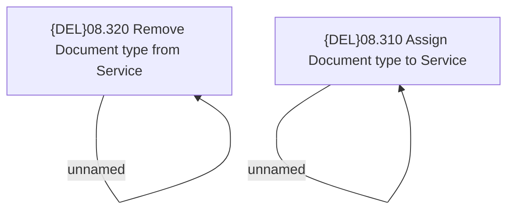

# Access Rights

- **Diagram Type**: Custom
- **Package**: HomerSelect/BSL/Modules/Product Catalog (PRC)/Analytical Model/Service/User Interface for Service Management/Document Type Assignment/Access Rights
- **Diagram ID**: 162637
- **Elements**: 4
- **Connectors**: 2

