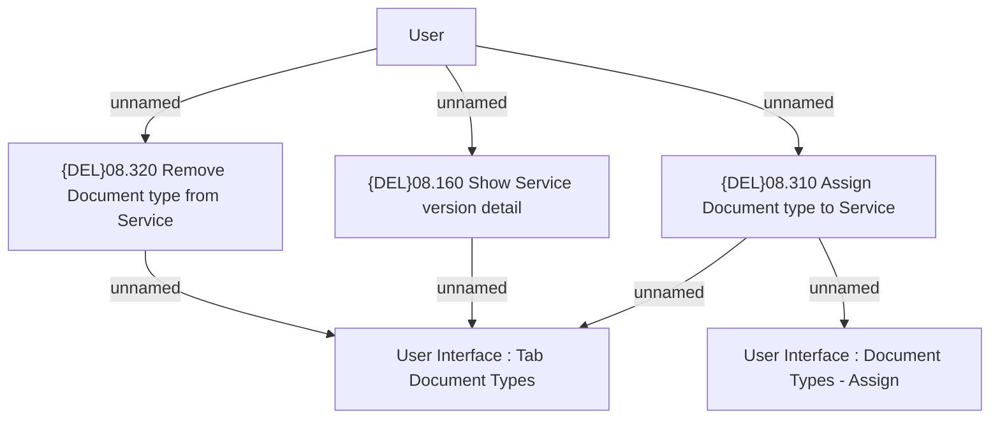

# Assignment Document Types to Service

- **Diagram Type**: Custom
- **Package**: HomerSelect/BSL/Modules/Product Catalog (PRC)/Analytical Model/Service/User Interface for Service Management/Document Type Assignment/Use Case
- **Diagram ID**: 162647
- **Elements**: 6
- **Connectors**: 7

