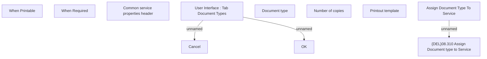

# Document Types - Assign

- **Diagram Type**: Custom
- **Package**: HomerSelect/BSL/Modules/Product Catalog (PRC)/Analytical Model/Service/User Interface for Service Management/Document Type Assignment/User Interface
- **Diagram ID**: 67631
- **Elements**: 11
- **Connectors**: 3

