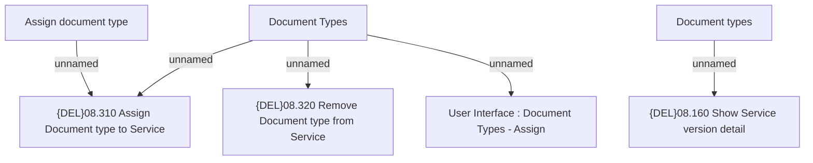

# Tab Document Types

```mermaid
graph TD
    User_Interface_Document_Types_Assign["User Interface : Document Types - Assign"]
    DEL_08_160_Show_Service_version_detail["{DEL}08.160 Show Service version detail"]
    DEL_08_310_Assign_Document_type_to_Service["{DEL}08.310 Assign Document type to Service"]
    DEL_08_320_Remove_Document_type_from_Service["{DEL}08.320 Remove Document type from Service"]
    Assign_document_type["Assign document type"]
    Document_Types["Document Types"]
    Document_types["Document types"]
    Document_types -->|unnamed| DEL_08_160_Show_Service_version_detail
    Document_Types -->|unnamed| DEL_08_310_Assign_Document_type_to_Service
    Document_Types -->|unnamed| DEL_08_320_Remove_Document_type_from_Service
    Assign_document_type -->|unnamed| DEL_08_310_Assign_Document_type_to_Service
    Document_Types -->|unnamed| User_Interface_Document_Types_Assign
```
