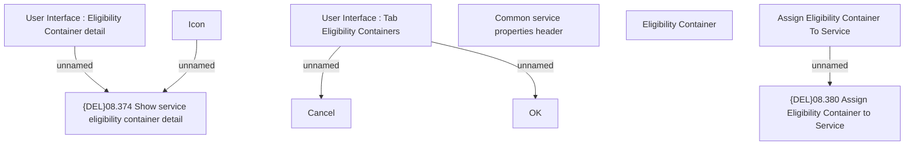

# Eligibility Containers - Assign

```mermaid
graph TD
    User_Interface_Eligibility_Container_detail["User Interface : Eligibility Container detail"]
    DEL_08_374_Show_service_eligibility_container_detail["{DEL}08.374 Show service eligibility container detail"]
    Icon["Icon"]
    User_Interface_Tab_Eligibility_Containers["User Interface : Tab Eligibility Containers"]
    DEL_08_380_Assign_Eligibility_Container_to_Service["{DEL}08.380 Assign Eligibility Container to Service"]
    Common_service_properties_header["Common service properties header"]
    OK["OK"]
    Cancel["Cancel"]
    Eligibility_Container["Eligibility Container"]
    Assign_Eligibility_Container_To_Service["Assign Eligibility Container To Service"]
    User_Interface_Tab_Eligibility_Containers -->|unnamed| Cancel
    User_Interface_Tab_Eligibility_Containers -->|unnamed| OK
    Assign_Eligibility_Container_To_Service -->|unnamed| DEL_08_380_Assign_Eligibility_Container_to_Service
    User_Interface_Eligibility_Container_detail -->|unnamed| DEL_08_374_Show_service_eligibility_container_detail
    Icon -->|unnamed| DEL_08_374_Show_service_eligibility_container_detail
```
