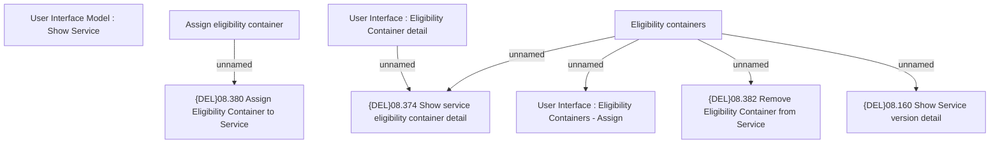

# Tab Eligibility Containers

```mermaid
graph TD
    User_Interface_Model_Show_Service["User Interface Model : Show Service"]
    User_Interface_Eligibility_Container_detail["User Interface : Eligibility Container detail"]
    DEL_08_374_Show_service_eligibility_container_detail["{DEL}08.374 Show service eligibility container detail"]
    User_Interface_Eligibility_Containers_Assign["User Interface : Eligibility Containers - Assign"]
    DEL_08_382_Remove_Eligibility_Container_from_Service["{DEL}08.382 Remove Eligibility Container from Service"]
    DEL_08_380_Assign_Eligibility_Container_to_Service["{DEL}08.380 Assign Eligibility Container to Service"]
    Assign_eligibility_container["Assign eligibility container"]
    Eligibility_containers["Eligibility containers"]
    Eligibility_containers["Eligibility containers"]
    DEL_08_160_Show_Service_version_detail["{DEL}08.160 Show Service version detail"]
    Eligibility_containers -->|unnamed| DEL_08_160_Show_Service_version_detail
    Assign_eligibility_container -->|unnamed| DEL_08_380_Assign_Eligibility_Container_to_Service
    Eligibility_containers -->|unnamed| DEL_08_382_Remove_Eligibility_Container_from_Service
    Eligibility_containers -->|unnamed| User_Interface_Eligibility_Containers_Assign
    Eligibility_containers -->|unnamed| DEL_08_374_Show_service_eligibility_container_detail
    User_Interface_Eligibility_Container_detail -->|unnamed| DEL_08_374_Show_service_eligibility_container_detail
```
