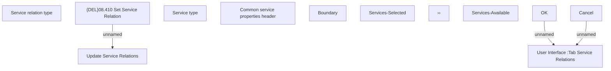

# Service Relations - Set

```mermaid
graph TD
    Service_relation_type["Service relation type"]
    DEL_08_410_Set_Service_Relation["{DEL}08.410 Set Service Relation"]
    User_Interface_Tab_Service_Relations["User Interface :Tab Service Relations"]
    Service_type["Service type"]
    Common_service_properties_header["Common service properties header"]
    el_1265941["Boundary"]
    Services_Selected["Services-Selected"]
    n_["‹‹"]
    n_["››"]
    Services_Available["Services-Available"]
    OK["OK"]
    Cancel["Cancel"]
    Update_Service_Relations["Update Service Relations"]
    OK -->|unnamed| User_Interface_Tab_Service_Relations
    Cancel -->|unnamed| User_Interface_Tab_Service_Relations
    DEL_08_410_Set_Service_Relation -->|unnamed| Update_Service_Relations
```
