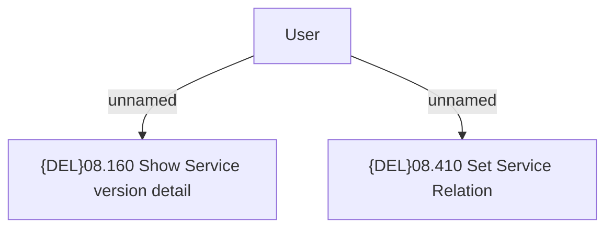

# Set Service Relations

- **Diagram Type**: Custom
- **Package**: HomerSelect/BSL/Modules/Product Catalog (PRC)/Analytical Model/Service/User Interface for Service Management/Service Exclusivity/Use Case
- **Diagram ID**: 162782
- **Elements**: 3
- **Connectors**: 2

