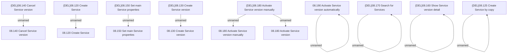

# Access Rights

```mermaid
graph TD
    n_08_190_Activate_Service_version_automatically["08.190 Activate Service version automatically"]
    DEL_08_170_Search_for_Services["{DEL}08.170 Search for Services"]
    DEL_08_160_Show_Service_version_detail["{DEL}08.160 Show Service version detail"]
    n_08_140_Cancel_Service_version["08.140 Cancel Service version"]
    n_08_120_Create_Service["08.120 Create Service"]
    n_08_150_Set_main_Service_properties["08.150 Set main Service properties"]
    DEL_08_125_Create_Service_by_copy["{DEL}08.125 Create Service by copy"]
    n_08_130_Create_Service_version["08.130 Create Service version"]
    n_08_180_Activate_Service_version_manually["08.180 Activate Service version manually"]
    n_08_180_Activate_Service_version["08.180 Activate Service version"]
    DEL_08_150_Set_main_Service_properties["{DEL}08.150 Set main Service properties"]
    DEL_08_140_Cancel_Service_version["{DEL}08.140 Cancel Service version"]
    DEL_08_130_Create_Service_version["{DEL}08.130 Create Service version"]
    DEL_08_180_Activate_Service_version_manually["{DEL}08.180 Activate Service version manually"]
    n_08_190_Activate_Service_version_automatically["08.190 Activate Service version automatically"]
    DEL_08_125_Create_Service_by_copy["{DEL}08.125 Create Service by copy"]
    DEL_08_120_Create_Service["{DEL}08.120 Create Service"]
    DEL_08_160_Show_Service_version_detail["{DEL}08.160 Show Service version detail"]
    DEL_08_170_Search_for_Services["{DEL}08.170 Search for Services"]
    DEL_08_180_Activate_Service_version_manually -->|unnamed| n_08_180_Activate_Service_version
    DEL_08_180_Activate_Service_version_manually -->|unnamed| n_08_180_Activate_Service_version_manually
    DEL_08_130_Create_Service_version -->|unnamed| n_08_130_Create_Service_version
    DEL_08_125_Create_Service_by_copy -->|unnamed| DEL_08_125_Create_Service_by_copy
    DEL_08_150_Set_main_Service_properties -->|unnamed| n_08_150_Set_main_Service_properties
    DEL_08_120_Create_Service -->|unnamed| n_08_120_Create_Service
    DEL_08_140_Cancel_Service_version -->|unnamed| n_08_140_Cancel_Service_version
    DEL_08_160_Show_Service_version_detail -->|unnamed| DEL_08_160_Show_Service_version_detail
    DEL_08_170_Search_for_Services -->|unnamed| DEL_08_170_Search_for_Services
    n_08_190_Activate_Service_version_automatically -->|unnamed| n_08_190_Activate_Service_version_automatically
```
