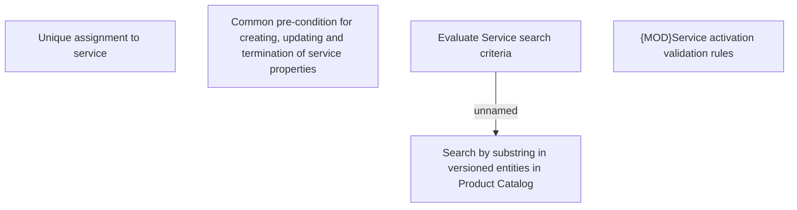

# Business Rules

```mermaid
graph TD
    Search_by_substring_in_versioned_entities_in_Product_Catalog["Search by substring in versioned entities in Product Catalog"]
    Unique_assignment_to_service["Unique assignment to service"]
    Common_pre_condition_for_creating_updating_and_termination_o["Common pre-condition for creating, updating and termination of service properties "]
    Evaluate_Service_search_criteria["Evaluate Service search criteria"]
    MOD_Service_activation_validation_rules["{MOD}Service activation validation rules"]
    Evaluate_Service_search_criteria -->|unnamed| Search_by_substring_in_versioned_entities_in_Product_Catalog
```
