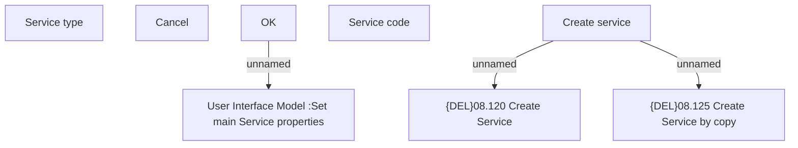

# Create Service

```mermaid
graph TD
    User_Interface_Model_Set_main_Service_properties["User Interface Model :Set main Service properties"]
    DEL_08_125_Create_Service_by_copy["{DEL}08.125 Create Service by copy"]
    DEL_08_120_Create_Service["{DEL}08.120 Create Service"]
    Service_type["Service type"]
    Cancel["Cancel"]
    OK["OK"]
    Service_code["Service code"]
    Create_service["Create service"]
    Create_service -->|unnamed| DEL_08_120_Create_Service
    Create_service -->|unnamed| DEL_08_125_Create_Service_by_copy
    OK -->|unnamed| User_Interface_Model_Set_main_Service_properties
```
