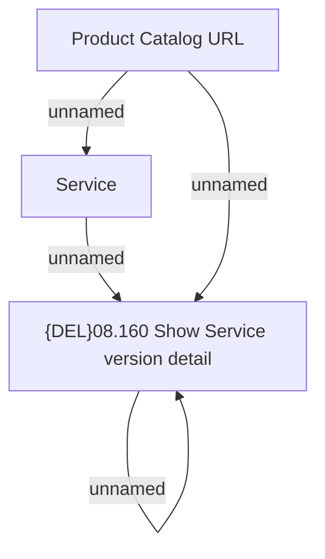

# Service Root URL

- **Diagram Type**: Custom
- **Package**: HomerSelect/BSL/Modules/Product Catalog (PRC)/Analytical Model/Service/User Interface for Service Management/Service Root/User Interface Model
- **Diagram ID**: 163154
- **Elements**: 4
- **Connectors**: 4

