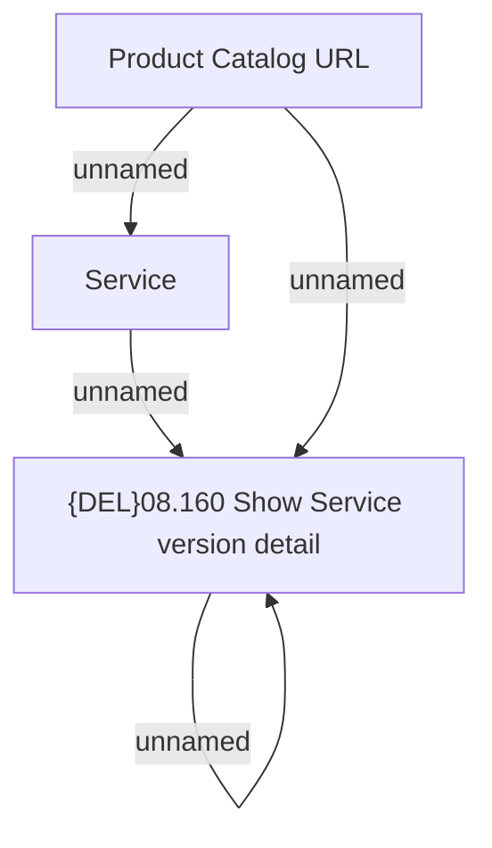

# Service Root URL

```mermaid
graph TD
    DEL_08_160_Show_Service_version_detail["{DEL}08.160 Show Service version detail"]
    DEL_08_160_Show_Service_version_detail["{DEL}08.160 Show Service version detail"]
    Service["Service"]
    Product_Catalog_URL["Product Catalog URL"]
    Product_Catalog_URL -->|unnamed| Service
    Service -->|unnamed| DEL_08_160_Show_Service_version_detail
    Product_Catalog_URL -->|unnamed| DEL_08_160_Show_Service_version_detail
    DEL_08_160_Show_Service_version_detail -->|unnamed| DEL_08_160_Show_Service_version_detail
```
