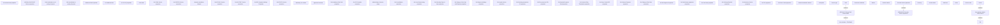

# Set main Service properties

```mermaid
graph TD
    Set_Interest_back_properties["Set Interest back properties"]
    ADD_Set_SALPROOF_Service_properties["{ADD}Set SALPROOF Service properties"]
    Limit_termination_out_of_cooling_off_period["Limit termination out of cooling off period"]
    Limit_cancellation_to_cooling_off_period["Limit cancellation to cooling off period"]
    Additional_Offer_Expiration["Additional Offer Expiration"]
    For_additional_offer["For additional offer"]
    Set_TOPUP_properties["Set TOPUP properties"]
    Filter_tariffs["Filter tariffs"]
    Set_PAYM_Service_properties["Set PAYM Service properties"]
    Set_PREFDD_Service_properties["Set PREFDD Service properties"]
    Manual_cancellation_allowed["Manual cancellation allowed"]
    Set_MTCACC_Service_properties["Set MTCACC Service properties"]
    Set_ACCSTMT_Service_properties["Set ACCSTMT Service properties"]
    Set_REL_Payment_Holidays_Properties["Set REL Payment Holidays Properties"]
    Set_RELFER_Service_properties["Set RELFER Service properties"]
    Mandatory_on_contract["Mandatory on contract"]
    Approval_Document["Approval Document"]
    Set_Installment_Plan_Pack_properties["Set Installment Plan Pack properties"]
    Set_CEL_Rewards_properties["Set CEL Rewards properties"]
    Minimal_days_of_service_usage["Minimal days of service usage"]
    Set_Consolidation_properties["Set Consolidation properties"]
    Set_Loan_Restructuring_properties["Set Loan Restructuring properties"]
    Set_Checking_Terms_of_Loan_properties["Set Checking Terms of Loan properties"]
    Set_Change_of_Due_Date_with_Request_properties["Set Change of Due Date with Request properties"]
    Set_Payment_Holidays_properties["Set Payment Holidays properties"]
    Set_Loyalty_Service_properties["Set Loyalty Service properties"]
    Set_Revolving_transaction_IP_properties["Set Revolving transaction IP properties"]
    Set_Zero_promo_for_REL_properties["Set Zero promo for REL properties"]
    Set_Standard_Payment_Card_properties["Set Standard Payment Card properties"]
    Set_Contract_Early_Termination_properties["Set Contract Early Termination properties"]
    Set_Grace_Period_REL_properties["Set Grace Period REL properties"]
    Set_Deferred_Payment_properties["Set Deferred Payment properties"]
    Set_Change_of_Due_Date_properties["Set Change of Due Date properties"]
    Set_Gift_Payment_Properties["Set Gift Payment Properties"]
    Set_Partial_early_repayment_properties["Set Partial early repayment properties"]
    Set_Fees_back_properties["Set Fees-back properties"]
    Set_Cooling_off_period_properties["Set Cooling-off period properties"]
    Set_Insurance_Service_properties["Set Insurance Service properties"]
    Set_FER_properties["Set FER properties"]
    Set_Grace_Period_properties["Set Grace Period properties"]
    Manual_termination_allowed["Manual termination allowed"]
    Description["Description"]
    Service_type["Service type"]
    Tariff["Tariff"]
    Terms_and_conditions["Terms and conditions"]
    Tariff["Tariff"]
    Valid_to["Valid to"]
    Version_number["Version number"]
    Cancel["Cancel"]
    Currency["Currency"]
    User_Interface_Model_Show_Service["User Interface Model :Show Service"]
    Version_status["Version status"]
    Valid_from["Valid from"]
    Name["Name"]
    Service_code["Service code"]
    OK["OK"]
    DEL_08_150_Set_main_Service_properties["{DEL}08.150 Set main Service properties"]
    User_Interface_Tariff_detail["User Interface : Tariff detail"]
    DEL_04_070_Show_Tariff_version_detail["{DEL}04.070 Show Tariff version detail"]
    Set_main_service_properties["Set main service properties"]
    Tariff -->|unnamed| DEL_04_070_Show_Tariff_version_detail
    DEL_04_070_Show_Tariff_version_detail -->|unnamed| User_Interface_Tariff_detail
    Set_main_service_properties -->|unnamed| DEL_08_150_Set_main_Service_properties
    User_Interface_Model_Show_Service -->|unnamed| OK
    Cancel -->|unnamed| User_Interface_Model_Show_Service
```
