# Show Service

- **Diagram Type**: Custom
- **Package**: HomerSelect/BSL/Modules/Product Catalog (PRC)/Analytical Model/Service/User Interface for Service Management/Service Root/User Interface Model
- **Diagram ID**: 163151
- **Elements**: 80
- **Connectors**: 8

```mermaid
graph TD
    Show_Interest_back_properties["Show Interest back properties"]
    ADD_TAB_Service_to_Product_Profile_Relations["{ADD} TAB Service to Product Profile Relations"]
    ADD_Show_Sales_Description_on_entity["{ADD}Show Sales Description on entity"]
    ADD_Show_SALPROOF_Service_properties["{ADD}Show SALPROOF Service properties"]
    Limit_termination_out_of_cooling_off_period["Limit termination out of cooling off period"]
    Limit_cancellation_to_cooling_off_period["Limit cancellation to cooling off period"]
    Additional_Offer_Expiration["Additional Offer Expiration"]
    For_additional_offer["For additional offer"]
    Show_TOPUP_properties["Show TOPUP properties"]
    Show_PAYM_Service_properties["Show PAYM Service properties"]
    Tab_Service_Limit["Tab Service Limit"]
    Show_PREFDD_Service_properties["Show PREFDD Service properties"]
    Manual_cancellation_allowed["Manual cancellation allowed"]
    Show_MTCACC_Service_properties["Show MTCACC Service properties"]
    Tab_Qualification_criteria["Tab Qualification criteria"]
    Show_ACCSTMT_Service_properties["Show ACCSTMT Service properties"]
    Show_REL_Payment_Holidays_Properties["Show REL Payment Holidays Properties"]
    Show_RELFER_Service_properties["Show RELFER Service properties"]
    Mandatory_on_contract["Mandatory on contract"]
    Approval_Document["Approval Document"]
    Tab_Subventions["Tab Subventions"]
    Show_Installment_Plan_Pack_properties["Show Installment Plan Pack properties"]
    Show_CEL_Rewards_properties["Show CEL Rewards properties"]
    Minimal_days_of_service_usage["Minimal days of service usage"]
    Show_Consolidation_properties["Show Consolidation properties"]
    Show_Loan_Restructuring_properties["Show Loan Restructuring properties"]
    Show_Checking_Terms_of_Loan_properties["Show Checking Terms of Loan properties"]
    Show_Change_of_Due_Date_with_Request_properties["Show Change of Due Date with Request properties"]
    Show_Payment_Holidays_properties["Show Payment Holidays properties"]
    Tab_Eligibility_Containers["Tab Eligibility Containers"]
    Show_Loyalty_Service_properties["Show Loyalty Service properties"]
    Tab_RELIP_Service_Variant["Tab RELIP Service Variant"]
    Show_REL_transaction_IP_properties["Show REL transaction IP properties"]
    Show_Zero_promo_for_REL_properties["Show Zero promo for REL properties"]
    Show_Standard_Payment_Card_properties["Show Standard Payment Card properties"]
    Show_Contract_Early_Termination_properties["Show Contract Early Termination properties"]
    Show_Grace_Period_REL_properties["Show Grace Period REL properties"]
    Show_Change_of_Due_Date_properties["Show Change of Due Date properties"]
    Show_Deferred_Payment_properties["Show Deferred Payment properties"]
    Show_Partial_early_repayment_properties["Show Partial early repayment properties"]
    Show_Fees_back_properties["Show Fees-back properties"]
    Show_Cooling_off_period_properties["Show Cooling-off period properties"]
    Show_Insurance_Service_properties["Show Insurance Service properties"]
    Tab_Service_Relations["Tab Service Relations"]
    Tab_Document_Types["Tab Document Types"]
    Show_FER_properties["Show FER properties"]
    Show_Grace_Period_properties["Show Grace Period properties"]
    Show_Gift_Payment_properties["Show Gift Payment properties"]
    Specific_service_information["Specific service information"]
    Manual_termination_allowed["Manual termination allowed"]
    DEL_08_160_Show_Service_version_detail["{DEL}08.160 Show Service version detail"]
    DEL_08_140_Cancel_Service_version["{DEL}08.140 Cancel Service version"]
    DEL_08_180_Activate_Service_version_manually["{DEL}08.180 Activate Service version manually"]
    DEL_08_130_Create_Service_version["{DEL}08.130 Create Service version"]
    DEL_08_125_Create_Service_by_copy["{DEL}08.125 Create Service by copy"]
    DEL_08_150_Set_main_Service_properties["{DEL}08.150 Set main Service properties"]
    Planned_activation_date["Planned activation date"]
    Version_terminated["Version terminated"]
    Version_activated["Version activated"]
    Version_number["Version number"]
    Tariff["Tariff"]
    Terms_Conditions["TermsandConditions"]
    Code["Code"]
    Description["Description"]
    Currency["Currency"]
    Version_status["Version status"]
    New_version["New version"]
    Copy_service["Copy service"]
    Update["Update"]
    Cancel_version["Cancel version"]
    Activate["Activate"]
    Buttons["Buttons"]
    Valid_to["Valid to"]
    Valid_from["Valid from"]
    Service_type["Service type"]
    Name["Name"]
    Common_service_information["Common service information"]
    Service["Service"]
    User_Interface_Tariff_detail["User Interface : Tariff detail"]
    DEL_04_070_Show_Tariff_version_detail["{DEL}04.070 Show Tariff version detail"]
    Tariff -->|unnamed| DEL_04_070_Show_Tariff_version_detail
    DEL_04_070_Show_Tariff_version_detail -->|unnamed| User_Interface_Tariff_detail
    Update -->|unnamed| DEL_08_150_Set_main_Service_properties
    Copy_service -->|unnamed| DEL_08_125_Create_Service_by_copy
    New_version -->|unnamed| DEL_08_130_Create_Service_version
    Activate -->|unnamed| DEL_08_180_Activate_Service_version_manually
    Cancel_version -->|unnamed| DEL_08_140_Cancel_Service_version
    Service -->|unnamed| DEL_08_160_Show_Service_version_detail
```

