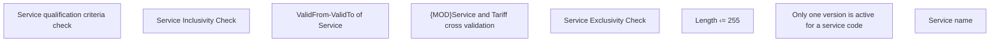

# Validation Rules

```mermaid
graph TD
    Service_qualification_criteria_check["Service qualification criteria check"]
    Service_Inclusivity_Check["Service Inclusivity Check"]
    ValidFrom_ValidTo_of_Service["ValidFrom-ValidTo of Service"]
    MOD_Service_and_Tariff_cross_validation["{MOD}Service and Tariff cross validation"]
    Service_Exclusivity_Check["Service Exclusivity Check"]
    Length_255["Length ‹= 255"]
    Only_one_version_is_active_for_a_service_code["Only one version is active for a service code"]
    Service_name["Service name"]
```
