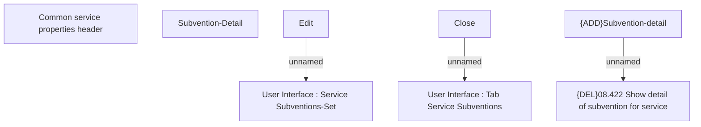

# Service Subventions-Detail

```mermaid
graph TD
    Common_service_properties_header["Common service properties header"]
    Subvention_Detail["Subvention-Detail"]
    User_Interface_Tab_Service_Subventions["User Interface : Tab Service Subventions"]
    User_Interface_Service_Subventions_Set["User Interface : Service Subventions-Set"]
    DEL_08_422_Show_detail_of_subvention_for_service["{DEL}08.422 Show detail of subvention for service"]
    Edit["Edit"]
    Close["Close"]
    ADD_Subvention_detail["{ADD}Subvention-detail"]
    ADD_Subvention_detail -->|unnamed| DEL_08_422_Show_detail_of_subvention_for_service
    Edit -->|unnamed| User_Interface_Service_Subventions_Set
    Close -->|unnamed| User_Interface_Tab_Service_Subventions
```
