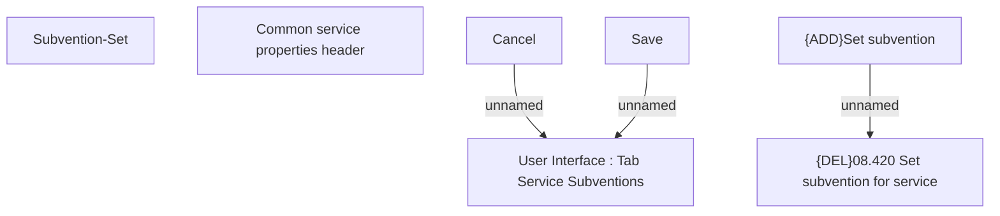

# Service Subventions-Set

- **Diagram Type**: Custom
- **Package**: HomerSelect/BSL/Modules/Product Catalog (PRC)/Analytical Model/Service/User Interface for Service Management/Service Subvention/User Interface
- **Diagram ID**: 102893
- **Elements**: 7
- **Connectors**: 3

