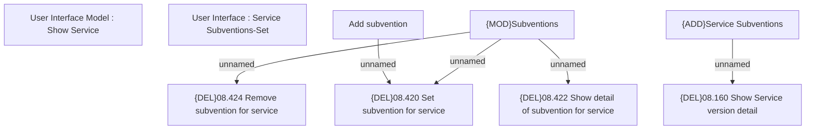

# Tab Service Subventions

- **Diagram Type**: Custom
- **Package**: HomerSelect/BSL/Modules/Product Catalog (PRC)/Analytical Model/Service/User Interface for Service Management/Service Subvention/User Interface
- **Diagram ID**: 102894
- **Elements**: 9
- **Connectors**: 5

