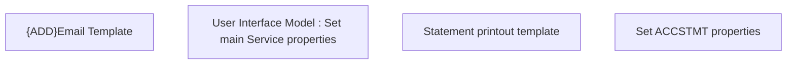

# Set ACCSTMT Service properties

```mermaid
graph TD
    ADD_Email_Template["{ADD}Email Template"]
    User_Interface_Model_Set_main_Service_properties["User Interface Model : Set main Service properties"]
    Statement_printout_template["Statement printout template"]
    Set_ACCSTMT_properties["Set ACCSTMT properties"]
```
