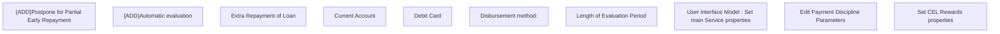

# Set CEL Rewards properties

```mermaid
graph TD
    ADD_Postpone_for_Partial_Early_Repayment["{ADD}Postpone for Partial Early Repayment"]
    ADD_Automatic_evaluation["{ADD}Automatic evaluation"]
    Extra_Repayment_of_Loan["Extra Repayment of Loan"]
    Current_Account["Current Account"]
    Debit_Card["Debit Card"]
    Disbursement_method["Disbursement method"]
    Disbursement_method["Disbursement method:"]
    Length_of_Evaluation_Period["Length of Evaluation Period"]
    User_Interface_Model_Set_main_Service_properties["User Interface Model : Set main Service properties"]
    Edit_Payment_Discipline_Parameters["Edit Payment Discipline Parameters"]
    Set_CEL_Rewards_properties["Set CEL Rewards properties"]
```
