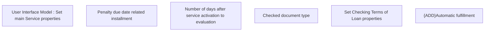

# Set Checking Terms of Loan properties

```mermaid
graph TD
    User_Interface_Model_Set_main_Service_properties["User Interface Model : Set main Service properties"]
    Penalty_due_date_related_installment["Penalty due date related installment"]
    Number_of_days_after_service_activation_to_evaluation["Number of days after service activation to evaluation"]
    Checked_document_type["Checked document  type"]
    Set_Checking_Terms_of_Loan_properties["Set Checking Terms of Loan properties"]
    ADD_Automatic_fulfillment["{ADD}Automatic fulfillment"]
```
