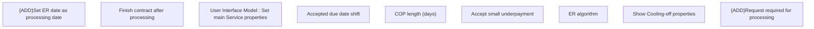

# Set Cooling-off period properties

```mermaid
graph TD
    ADD_Set_ER_date_as_processing_date["{ADD}Set ER date as processing date"]
    Finish_contract_after_processing["Finish contract after processing"]
    User_Interface_Model_Set_main_Service_properties["User Interface Model : Set main Service properties"]
    Accepted_due_date_shift["Accepted due date shift"]
    COP_length_days["COP length (days)"]
    Accept_small_underpayment["Accept small underpayment"]
    ER_algorithm["ER algorithm"]
    Show_Cooling_off_properties["Show Cooling-off properties"]
    ADD_Request_required_for_processing["{ADD}Request required for processing"]
```
