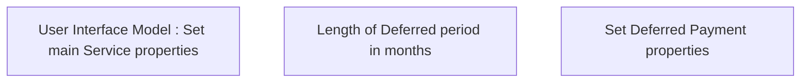

# Set Deferred Payment properties

```mermaid
graph TD
    User_Interface_Model_Set_main_Service_properties["User Interface Model : Set main Service properties"]
    Length_of_Deferred_period_in_months["Length of Deferred period in months"]
    Set_Deferred_Payment_properties["Set Deferred Payment properties"]
```
