# Set FER properties

- **Diagram Type**: Custom
- **Package**: HomerSelect/BSL/Modules/Product Catalog (PRC)/Analytical Model/Service/User Interface for Service Management/Service Type Specific Extension/FER/User Interface
- **Diagram ID**: 157036
- **Elements**: 27
- **Connectors**: 0

```mermaid
graph TD
    ADD_Block_request_reactivation["{ADD}Block request reactivation"]
    ADD_Use_current_date["{ADD}Use current date"]
    Use_payment_deposit_date["Use payment deposit date"]
    Include_principal_only["Include principal only"]
    Automatic_service_processing["Automatic service processing"]
    Set_ER_date_as_processing_date["Set ER date as processing date"]
    Number_Of_Installments_To["Number Of Installments To"]
    Number_Of_Installments_From["Number Of Installments From"]
    Moratorium_Length["Moratorium Length"]
    Add_Variant["Add Variant"]
    Delete_Variant["Delete Variant"]
    Variants["Variants"]
    Include_GIFT_Payments["Include GIFT Payments"]
    Perform_request_in_moratorium["Perform request in moratorium"]
    Finish_contract_after_processing["Finish contract after processing"]
    Enable_processing_on_balance_change["Enable processing on balance change"]
    Maximal_days_before_ER["Maximal days before ER"]
    Allow_ER_date_choice["Allow ER date choice"]
    Allow_request_in_moratorium["Allow request in moratorium"]
    User_Interface_Model_Set_main_Service_properties["User Interface Model : Set main Service properties"]
    ER_Algorithm["ER Algorithm"]
    Moratorium_in_months["Moratorium in months"]
    DPD_maximal_limit["DPD maximal limit"]
    Minimum_days_before_ER["Minimum days before ER"]
    Accept_small_underpayment["Accept small underpayment"]
    Accepted_due_date_shift["Accepted due date shift"]
    Set_FER_properties["Set FER properties"]
```

