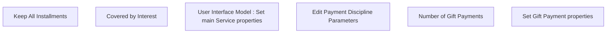

# Set Gift Payment Properties

```mermaid
graph TD
    Keep_All_Installments["Keep All Installments"]
    Covered_by_Interest["Covered by Interest"]
    User_Interface_Model_Set_main_Service_properties["User Interface Model : Set main Service properties"]
    Edit_Payment_Discipline_Parameters["Edit Payment Discipline Parameters"]
    Number_of_Gift_Payments["Number of Gift Payments"]
    Set_Gift_Payment_properties["Set Gift Payment properties"]
```
