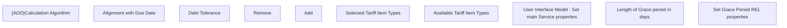

# Set Grace Period REL properties

```mermaid
graph TD
    ADD_Calculation_Algorithm["{ADD}Calculation Algorithm"]
    Alignment_with_Due_Date["Alignment with Due Date"]
    Debt_Tolerance["Debt Tolerance"]
    Remove["Remove"]
    Add["Add"]
    Selected_Tariff_Item_Types["Selected Tariff Item Types"]
    Available_Tariff_Item_Types["Available Tariff Item Types "]
    User_Interface_Model_Set_main_Service_properties["User Interface Model : Set main Service properties"]
    Length_of_Grace_period_in_days["Length of Grace period in days"]
    Set_Grace_Period_REL_properties["Set Grace Period REL properties"]
```
