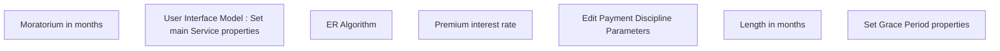

# Set Grace Period properties

- **Diagram Type**: Custom
- **Package**: HomerSelect/BSL/Modules/Product Catalog (PRC)/Analytical Model/Service/User Interface for Service Management/Service Type Specific Extension/GRPER/User Interface
- **Diagram ID**: 155619
- **Elements**: 7
- **Connectors**: 0

