# Set Installment Plan Pack properties

- **Diagram Type**: Custom
- **Package**: HomerSelect/BSL/Modules/Product Catalog (PRC)/Analytical Model/Service/User Interface for Service Management/Service Type Specific Extension/IPPACK/User interface
- **Diagram ID**: 147390
- **Elements**: 12
- **Connectors**: 0

```mermaid
graph TD
    ADD_Service_Level["{ADD}Service Level"]
    Remove["Remove"]
    Add["Add"]
    Selected_Financing_Packages["Selected Financing Packages"]
    Available_Financing_Packages["Available Financing Packages"]
    Set_Installment_Plan_Pack_to_Financing_Package["Set Installment Plan Pack to Financing Package"]
    Remove["Remove"]
    Add["Add"]
    Selected_Financing_Package_Purposes["Selected Financing Package Purposes"]
    Available_Financing_Package_Purposes["Available Financing Package Purposes"]
    User_Interface_Model_Set_main_Service_properties["User Interface Model : Set main Service properties"]
    Set_Installment_Plan_Pack_properties["Set Installment Plan Pack properties"]
```

