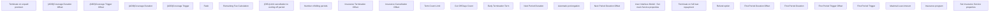

# Set Insurance Service properties

```mermaid
graph TD
    Terminate_on_unpaid_premium["Terminate on unpaid premium"]
    ADD_Coverage_Duration_Offset["{ADD}Coverage Duration Offset"]
    ADD_Coverage_Trigger_Offset["{ADD}Coverage Trigger Offset"]
    ADD_Coverage_Duration["{ADD}Coverage Duration"]
    ADD_Coverage_Trigger["{ADD}Coverage Trigger"]
    Ratio["Ratio"]
    Remaining_Fee_Calculation["Remaining Fee Calculation"]
    DEL_Limit_cancellation_to_cooling_off_period["{DEL}Limit cancellation to cooling off period"]
    Number_of_billing_periods["Number of billing periods"]
    Insurance_Termination_Offset["Insurance Termination Offset"]
    Insurance_Cancellation_Offset["Insurance Cancellation Offset"]
    Term_Count_Limit["Term Count Limit"]
    Cut_Off_Days_Count["Cut Off Days Count"]
    Early_Termination_Term["Early Termination Term"]
    Next_Period_Duration["Next Period Duration"]
    Automatic_prolongation["Automatic prolongation"]
    Next_Period_Duration_Offset["Next Period Duration Offset"]
    User_Interface_Model_Set_main_Service_properties["User Interface Model : Set main Service properties"]
    Terminate_on_full_loan_repayment["Terminate on full loan repayment"]
    Refund_option["Refund option"]
    First_Period_Duration_Offset["First Period Duration Offset"]
    First_Period_Duration["First Period Duration"]
    First_Period_Trigger_Offset["First Period Trigger Offset"]
    First_Period_Trigger["First Period Trigger"]
    Maximal_Loan_Amount["Maximal Loan Amount"]
    Insurance_program["Insurance program"]
    Set_Insurance_Service_properties["Set Insurance Service properties"]
```
