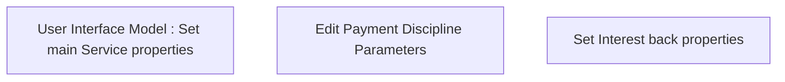

# Set Interest back properties

- **Diagram Type**: Custom
- **Package**: HomerSelect/BSL/Modules/Product Catalog (PRC)/Analytical Model/Service/User Interface for Service Management/Service Type Specific Extension/IBACK/User Interface
- **Diagram ID**: 163169
- **Elements**: 3
- **Connectors**: 0

