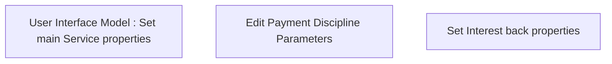

# Set Interest back properties

```mermaid
graph TD
    User_Interface_Model_Set_main_Service_properties["User Interface Model : Set main Service properties"]
    Edit_Payment_Discipline_Parameters["Edit Payment Discipline Parameters"]
    Set_Interest_back_properties["Set Interest back properties"]
```
