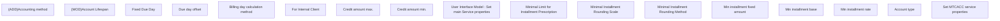

# Set MTCACC Service properties

```mermaid
graph TD
    ADD_Accounting_method["{ADD}Accounting method"]
    MOD_Account_Lifespan["{MOD}Account Lifespan"]
    Fixed_Due_Day["Fixed Due Day"]
    Due_day_offset["Due day offset"]
    Billing_day_calculation_method["Billing day calculation method"]
    For_Internal_Client["For Internal Client"]
    Credit_amount_max["Credit amount max."]
    Credit_amount_min["Credit amount min."]
    User_Interface_Model_Set_main_Service_properties["User Interface Model : Set main Service properties"]
    Minimal_Limit_for_Installment_Prescription["Minimal Limit for Installment Prescription"]
    Minimal_Installment_Rounding_Scale["Minimal Installment Rounding Scale"]
    Minimal_Installment_Rounding_Method["Minimal Installment Rounding Method"]
    Min_installment_fixed_amount["Min installment fixed amount"]
    Min_installment_base["Min installment base"]
    Min_installment_rate["Min installment rate"]
    Account_type["Account type"]
    Set_MTCACC_service_properties["Set MTCACC service properties"]
```
