# Set Partial early repayment properties

- **Diagram Type**: Custom
- **Package**: HomerSelect/BSL/Modules/Product Catalog (PRC)/Analytical Model/Service/User Interface for Service Management/Service Type Specific Extension/PER/User Interface Model
- **Diagram ID**: 163394
- **Elements**: 14
- **Connectors**: 0

```mermaid
graph TD
    ADD_Minimal_remainig_principal_percentage["{ADD}Minimal remainig principal - percentage"]
    ADD_Minimal_remaining_principal_percentage_base["{ADD}Minimal remaining principal - percentage base"]
    ADD_Minimal_remaining_principal_fixed_amount["{ADD}Minimal remaining principal - fixed amount"]
    ADD_Maximal_number_of_usage["{ADD}Maximal number of usage"]
    Minimal_Last_Installment_Amount["Minimal Last Installment Amount"]
    Minimal_PER_Amount_Rate["Minimal PER Amount Rate"]
    Allow_request_in_moratorium["Allow request in moratorium"]
    PER_type["PER type"]
    Moratorium_in_months["Moratorium in months"]
    DPD_maximal_limit["DPD maximal limit"]
    Minimum_days_before_PER["Minimum days before PER"]
    Allow_PER_Amount_Interval["Allow PER Amount Interval"]
    Accepted_due_date_shift["Accepted due date shift"]
    Set_Partial_early_repayment_properties["Set Partial early repayment properties"]
```

