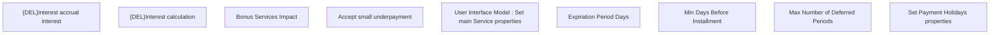

# Set Payment Holidays properties

```mermaid
graph TD
    DEL_Interest_accrual_interest["{DEL}Interest accrual interest"]
    DEL_Interest_calculation["{DEL}Interest calculation"]
    Bonus_Services_Impact["Bonus Services Impact"]
    Accept_small_underpayment["Accept small underpayment"]
    User_Interface_Model_Set_main_Service_properties["User Interface Model : Set main Service properties"]
    Expiration_Period_Days["Expiration Period Days"]
    Min_Days_Before_Installment["Min Days Before Installment"]
    Max_Number_of_Deferred_Periods["Max Number of Deferred Periods"]
    Set_Payment_Holidays_properties["Set Payment Holidays properties"]
```
