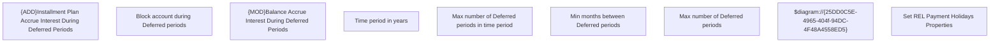

# Set REL Payment Holidays Properties

```mermaid
graph TD
    ADD_Installment_Plan_Accrue_Interest_During_Deferred_Periods["{ADD}Installment Plan Accrue Interest During Deferred Periods"]
    Block_account_during_Deferred_periods["Block account during Deferred periods"]
    MOD_Balance_Accrue_Interest_During_Deferred_Periods["{MOD}Balance Accrue Interest During Deferred Periods"]
    Time_period_in_years["Time period in years"]
    Max_number_of_Deferred_periods_in_time_period["Max number of Deferred periods in time period"]
    Min_months_between_Deferred_periods["Min months between Deferred periods"]
    Max_number_of_Deferred_periods["Max number of Deferred periods"]
    diagram_25DD0C5E_4965_404f_94DC_4F48A4558ED5["$diagram://{25DD0C5E-4965-404f-94DC-4F48A4558ED5}"]
    Set_REL_Payment_Holidays_Properties["Set REL Payment Holidays Properties"]
```
