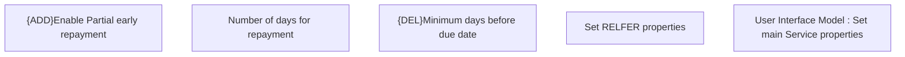

# Set RELFER Service properties

```mermaid
graph TD
    ADD_Enable_Partial_early_repayment["{ADD}Enable Partial early repayment"]
    Number_of_days_for_repayment["Number of days for repayment"]
    DEL_Minimum_days_before_due_date["{DEL}Minimum days before due date"]
    Set_RELFER_properties["Set RELFER properties"]
    User_Interface_Model_Set_main_Service_properties["User Interface Model : Set main Service properties"]
```
