# Set RELIP Service Variant

- **Diagram Type**: Custom
- **Package**: HomerSelect/BSL/Modules/Product Catalog (PRC)/Analytical Model/Service/User Interface for Service Management/Service Type Specific Extension/RELIP/User Interface
- **Diagram ID**: 104342
- **Elements**: 38
- **Connectors**: 7

```mermaid
graph TD
    PastDueInitAIR["PastDueInitAIR"]
    PastDueAIR["PastDueAIR"]
    Premium["Premium"]
    Remove["Remove"]
    Add["Add"]
    Selected_Merchants["Selected Merchants"]
    Available_Merchants["Available Merchants"]
    Merchants["Merchants"]
    Selected_Rating_Groups["Selected Rating Groups"]
    Remove["Remove"]
    Add["Add"]
    Available_Rating_Groups["Available Rating Groups"]
    Tab_RELIP_Service_Variant["Tab RELIP Service Variant"]
    InitAIR["InitAIR"]
    InitTerm["InitTerm"]
    Description["Description"]
    Name["Name"]
    RELIP_Service_Variant_Term_validation_rules["RELIP Service Variant Term - validation rules"]
    RELIP_Service_Variant_unique_key["RELIP Service Variant - unique key"]
    Add_Term["Add Term"]
    Delete_Term["Delete Term"]
    AIR["AIR"]
    Term["Term"]
    Terms["Terms"]
    RELIP_Service_Variant_allowed_combination_rules["RELIP Service Variant - allowed combination rules"]
    RELIP_Service_Variant_validation_rules["RELIP Service Variant - validation rules"]
    Installment_Plan_Type["Installment Plan Type"]
    Transaction_Date_To["Transaction Date To"]
    Transaction_Date_From["Transaction Date From"]
    Transaction_Amount_Max["Transaction Amount Max"]
    Transaction_Amount_Min["Transaction Amount Min"]
    Transaction_Type["Transaction Type"]
    Number["Number"]
    Cancel["Cancel"]
    OK["OK"]
    Common_service_properties_header["Common service properties header"]
    n_08_512_Set_RELIP_service_variant["08.512 Set RELIP service variant"]
    Set_RELIP_service_variant["Set RELIP service variant"]
    Set_RELIP_service_variant -->|unnamed| n_08_512_Set_RELIP_service_variant
    Set_RELIP_service_variant -->|unnamed| RELIP_Service_Variant_validation_rules
    RELIP_Service_Variant_validation_rules -->|unnamed| RELIP_Service_Variant_allowed_combination_rules
    RELIP_Service_Variant_validation_rules -->|unnamed| RELIP_Service_Variant_unique_key
    RELIP_Service_Variant_validation_rules -->|unnamed| RELIP_Service_Variant_Term_validation_rules
    Cancel -->|unnamed| Tab_RELIP_Service_Variant
    OK -->|unnamed| Tab_RELIP_Service_Variant
```

