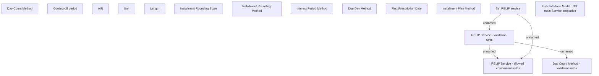

# Set RELIP service 

```mermaid
graph TD
    Day_Count_Method_validation_rules["Day Count Method - validation rules"]
    Day_Count_Method["Day Count Method"]
    RELIP_Service_allowed_combination_rules["RELIP Service - allowed combination rules"]
    RELIP_Service_validation_rules["RELIP Service - validation rules"]
    Cooling_off_period["Cooling-off period"]
    AIR["AIR"]
    Unit["Unit"]
    Length["Length"]
    Installment_Rounding_Scale["Installment Rounding Scale"]
    Installment_Rounding_Method["Installment Rounding Method"]
    Interest_Period_Method["Interest Period Method"]
    Due_Day_Method["Due Day Method"]
    First_Prescription_Date["First Prescription Date"]
    Installment_Plan_Method["Installment Plan Method"]
    Set_RELIP_service["Set RELIP service "]
    User_Interface_Model_Set_main_Service_properties["User Interface Model : Set main Service properties"]
    Set_RELIP_service -->|unnamed| RELIP_Service_validation_rules
    RELIP_Service_validation_rules -->|unnamed| RELIP_Service_allowed_combination_rules
    Set_RELIP_service -->|unnamed| RELIP_Service_allowed_combination_rules
    RELIP_Service_validation_rules -->|unnamed| Day_Count_Method_validation_rules
```
