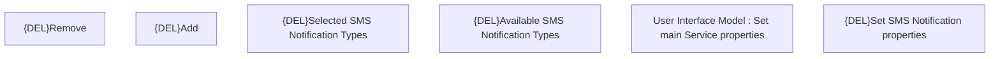

# Set SMS Notification properties

- **Diagram Type**: Custom
- **Package**: HomerSelect/BSL/Modules/Product Catalog (PRC)/Analytical Model/Service/User Interface for Service Management/Service Type Specific Extension/SMSN/User Interface
- **Diagram ID**: 107517
- **Elements**: 6
- **Connectors**: 0

