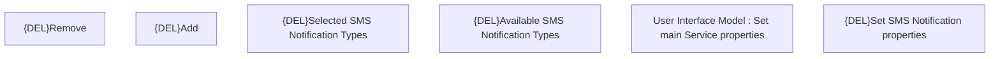

# Set SMS Notification properties

```mermaid
graph TD
    DEL_Remove["{DEL}Remove"]
    DEL_Add["{DEL}Add"]
    DEL_Selected_SMS_Notification_Types["{DEL}Selected SMS Notification Types"]
    DEL_Available_SMS_Notification_Types["{DEL}Available SMS Notification Types "]
    User_Interface_Model_Set_main_Service_properties["User Interface Model : Set main Service properties"]
    DEL_Set_SMS_Notification_properties["{DEL}Set SMS Notification properties"]
```
