# Set Standard Payment Card properties

- **Diagram Type**: Custom
- **Package**: HomerSelect/BSL/Modules/Product Catalog (PRC)/Analytical Model/Service/User Interface for Service Management/Service Type Specific Extension/CRDPST/User Interface
- **Diagram ID**: 114036
- **Elements**: 10
- **Connectors**: 0

```mermaid
graph TD
    Customer_Address_Delivery_Allowed["Customer Address Delivery Allowed"]
    POS_Delivery_Allowed["POS Delivery Allowed"]
    Personalized_Card_Type["Personalized Card Type"]
    Instant_Card_Type["Instant Card Type"]
    Instant_Card_Allowed["Instant Card Allowed"]
    Personalized_Card_Allowed["Personalized Card Allowed"]
    Postponed_Activation_Offset["Postponed Activation Offset"]
    Postponed_Activation_Months["Postponed Activation Months"]
    User_Interface_Model_Set_main_Service_properties["User Interface Model : Set main Service properties"]
    Set_Payment_Card_properties["Set Payment Card properties"]
```

