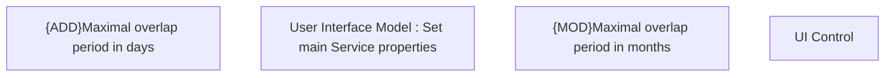

# Set TOPUP properties

```mermaid
graph TD
    ADD_Maximal_overlap_period_in_days["{ADD}Maximal overlap period in days"]
    User_Interface_Model_Set_main_Service_properties["User Interface Model : Set main Service properties"]
    MOD_Maximal_overlap_period_in_months["{MOD}Maximal overlap period in months"]
    UI_Control["UI Control"]
```
