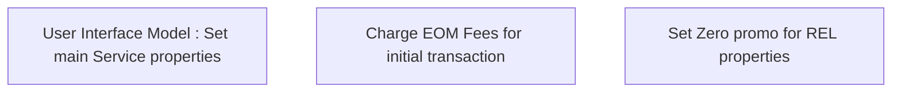

# Set Zero promo for REL properties

```mermaid
graph TD
    User_Interface_Model_Set_main_Service_properties["User Interface Model : Set main Service properties"]
    Charge_EOM_Fees_for_initial_transaction["Charge EOM Fees for initial transaction"]
    Set_Zero_promo_for_REL_properties["Set Zero promo for REL properties"]
```
