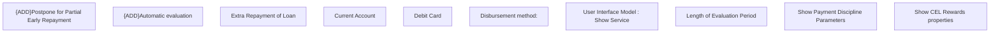

# Show CEL Rewards properties

```mermaid
graph TD
    ADD_Postpone_for_Partial_Early_Repayment["{ADD}Postpone for Partial Early Repayment"]
    ADD_Automatic_evaluation["{ADD}Automatic evaluation"]
    Extra_Repayment_of_Loan["Extra Repayment of Loan"]
    Current_Account["Current Account"]
    Debit_Card["Debit Card"]
    Disbursement_method["Disbursement method"]
    Disbursement_method["Disbursement method:"]
    User_Interface_Model_Show_Service["User Interface Model : Show Service"]
    Length_of_Evaluation_Period["Length of Evaluation Period"]
    Show_Payment_Discipline_Parameters["Show Payment Discipline Parameters"]
    Show_CEL_Rewards_properties["Show CEL Rewards properties"]
```
